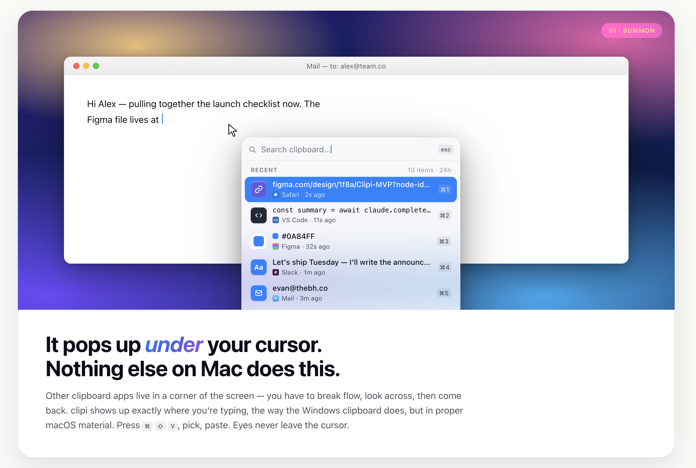

# clipi

**A keyboard-first clipboard manager for macOS.** Press **⌥⌘V** anywhere — clipi opens under your cursor with your last 10 copies. Pick one with the arrow keys (or `⌘1`–`⌘9`), hit `↵`, and the item is pasted back into whatever app you came from.

Built to be small, fast, and out-of-the-way. No subscription, no telemetry, no cloud, no Electron.



## Install

Easiest path is the personal Homebrew tap:

```sh
brew install --cask navjots35/tap/clipi
```

Or grab the signed + notarized DMG directly from [Releases](https://github.com/navjots35/clipi/releases) and drag `clipi.app` into `Applications`. macOS 13 (Ventura) or newer.

**First launch:**

1. A welcome card explains the keyboard model.
2. macOS prompts for **Accessibility** access. Grant it — clipi needs it to position the panel at your text caret and to synthesize the paste keystroke into the previously focused app.
3. Press **⌥⌘V** anywhere. That's it.

## Keyboard

Inside the panel:

| Key | Action |
|---|---|
| `↑` `↓` | Move selection |
| `↵` | Paste with original formatting |
| `⌘↵` | Paste as plain text (strips rich formatting) |
| `1`–`9`, `0` | Jump-paste an item by position (works when the search field is empty) |
| `esc` | Close (or clear search if typing) |
| `⌘,` | Open Settings |
| Type to search | Fuzzy filter across content + source app name |

## Privacy

The clipboard is one of the most sensitive surfaces on your machine. clipi is paranoid by default:

- **Password managers are excluded out of the box** — 1Password, Bitwarden, Keychain Access, LastPass, Dashlane, Proton Pass.
- **Browser password fields are detected via Accessibility** (`AXSecureTextField`) and not captured, so banking sites and login forms never end up in your history.
- **Items marked `org.nspasteboard.ConcealedType`** by other apps are honored — well-behaved password managers self-mark and we respect that.
- **Terminal & iTerm copies are stored as plain text only** so escape sequences and ANSI noise can't sneak into your history.
- **History is local-first** — JSON file at `~/Library/Application Support/clipi/history.json`, never sent anywhere.

You can edit the per-app rules in **Settings → Per-app rules** (⌘, in the panel, or via the menu-bar icon).

## Contributing

PRs are welcome. clipi is small on purpose, so the bar for new features is "does this make the keyboard flow tighter?" — see [CONTRIBUTING.md](CONTRIBUTING.md) for the full bar and what's likely to get pushback.

**Branch model:**

- `main` — production. Protected. Only release-ready code, only merged via PR.
- `develop` — integration. **All PRs target `develop`.** When `develop` is stable, a release PR brings it into `main`.
- Topic branches — your changes live here, branched off `develop`, named like `fix/settings-close-recursion` or `feat/sparkle-updater`.

**The 60-second contributor loop:**

```sh
git clone https://github.com/navjots35/clipi.git
cd clipi
git switch -c fix/your-thing develop
./scripts/build.sh        # ad-hoc signed dev build at build/clipi.app
open build/clipi.app
# make your change, smoke-test the affected flow
git push -u origin fix/your-thing
gh pr create --base develop
```

CI runs automatically on every PR — builds the app on macOS 14 + macOS-latest, under both `-Onone` (fast) and `-O` (release-grade) so optimization-only regressions can't sneak in. Bundle structure, code signature, and required Info.plist keys are all verified.

**Reporting bugs:** use the [bug report template](https://github.com/navjots35/clipi/issues/new?template=bug_report.yml). Include macOS version, install method, and a crash log if applicable.

**Suggesting features:** [feature request template](https://github.com/navjots35/clipi/issues/new?template=feature_request.yml). Lead with the *problem* you're hitting; the solution comes second.

**Security issues:** if you find something that could capture data clipi shouldn't, please flag it privately first — start the issue subject with `security:` so it gets routed correctly.

## Build from source

Requires the Xcode command-line tools (Swift 6, the Swift toolchain that ships with Xcode 15+).

```sh
./scripts/build.sh                    # ad-hoc signed dev build
OPT_FLAG=-O ./scripts/build.sh        # release-grade optimization
./scripts/release.sh                  # signed, notarized, packaged DMG (requires Developer ID)
./scripts/bump-version.sh patch       # bump CFBundleShortVersionString + CFBundleVersion
./scripts/make-icon.sh                # regenerate the .icns from make-icon.swift
```

`scripts/release.sh` handles Developer ID signing, Apple notarization (via `xcrun notarytool`), stapling, and DMG packaging end-to-end — it expects a `clipi-notary` keychain profile created once with `xcrun notarytool store-credentials`.

## Architecture (brief)

- `Sources/Clipi/Models/` — `ClipboardStore`, `ClipboardItem`, `AppSettings`, JSON persistence.
- `Sources/Clipi/Services/` — `PasteboardWatcher` (polls `NSPasteboard.changeCount`), `HotkeyManager` (Carbon `RegisterEventHotKey` for the global ⌥⌘V), `Paster` (writes pasteboard + synthesizes ⌘V via `CGEvent.post`), `SecureFieldDetector` (AX role check for `AXSecureTextField`), `CaretLocator` (AX-based caret position for "panel under cursor").
- `Sources/Clipi/UI/` — SwiftUI panel, settings window, onboarding card. `PanelController` hosts the SwiftUI panel inside a non-activating `NSPanel` so summoning clipi never steals activation from your current app.

## Status

Early. Working well enough to be the author's daily driver. Things still on the list:

- Custom hotkey recording (currently fixed at ⌥⌘V)
- Sparkle-based auto-updates
- Theme / accent customization
- Item detail / preview pane (image preview, copy-as-actions)

## License

[MIT](LICENSE)

## Acknowledgements

Designed with [Claude Design](https://claude.ai/design); implemented in collaboration with Claude Code.
